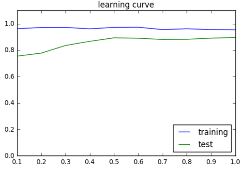
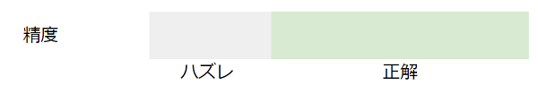
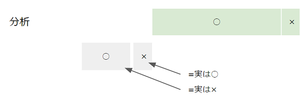
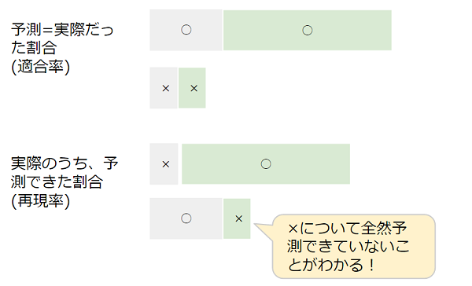

# Baby Steps of Machine Learning

機械学習モデルを実装するための、基礎的なステップを学ぶためのリポジトリです。

## 0.Setup

### 0-1. Environmental Construction

環境構築については、以下の手順を参考にしてください。

[Pythonで機械学習アプリケーションの開発環境を構築する](http://qiita.com/icoxfog417/items/950b8af9100b64c0d8f9)

### 0-2. Download Source Code

以下のGitHubリポジトリを**forkして**、そこからダウンロード(もしくはclone)してください。

[icoxfog417/baby_steps_of_machine_learning](https://github.com/icoxfog417/baby_steps_of_machine_learning)  
Starも押していただけると励みになりますm(_ _)m

forkとは、オリジナルのコードをコピーして手元に持ってくることです。これで、自分なりの編集などを行うことができます。

### 0-3. アプリケーションの動作確認

アプリケーションを動作させるための仮想環境を有効化します。  
※以下は、0-1の環境構築の手順通り用意してきた場合(Minicondaで仮想環境ml_envを作成)を想定しています。変えている場合は、適宜読み替えてください。

Windows(コマンドプロンプトから実行)

```
activate ml_env
```

Mac/Linux(ターミナルから実行 (#で始まる行はコメントなので、実行する際は無視してください))

```
# pyenvとのバッティングを防ぐため、activateは仮想環境のパスを確認し直接実行する
conda info -e
# conda environments:
#
ml_env                   /usr/local/pyenv/versions/miniconda-X.X.X/envs/ml_env
root                  *  /usr/local/pyenv/versions/miniconda-X.X.X

source /usr/local/pyenv/versions/minicondaX.X.X/envs/ml_env/bin/activate ml_env
```

※miniconda-X.X.Xは、インストールしたminicondaのバージョンによって変わります。

仮想環境が有効化出来たら、Jupyter Notebookを起動してみます。これは、インタラクティブにPythonの実行ができるアプリケーションです。  
このリポジトリをダウンロードしたフォルダの直下で、以下のコマンドを実行します。

```
jupyter notebook
```

Webブラウザのページが立ち上がったら準備完了です。Jupyter Notebookの使い方については順次紹介していきますが、以下の資料もご参考ください。

[はじめるJupyter Notebook](http://qiita.com/icoxfog417/items/175f69d06f4e590face9)

## 1. Make Machine Learning Model Basic

では、Jupyter Notebookを使って機械学習モデルを作成するプロセスを体感していきます。

Jupyter Notebookを立ち上げて、`worksheet.ipynb`を開いてください。  
こちらには機械学習の各ステップが順番に書かれているので、そちらに従い上から順に実行をしていきます。
途中にある`write your code here`については、この後に解説をしていくためいったん無視して頂いて構いません。解説を読みながら、最後のモデルの保存まで行ってみてください。

## 2. Data Preprocessing

機械学習において、集めたデータがそのまま使える、ということは稀です。  
精度の高いモデルを作るため、学習のスピードを上げるため、データをモデルにとって適切な形に加工する処理が欠かせません(生の食材を、調理するようなイメージです)。  
多くの場合、この前処理が最終的な精度に大きなインパクトを与えます。今回は前処理の一つの手法である、正規化を実行してみます。

正規化とは、各特徴について平均を0、標準偏差を1にそろえる処理です。これで学習速度の向上を図ることができます。  


実際、身長や体重といった様々な特徴がある場合、その単位はバラバラでとる値の範囲も異なります。このままでは扱いづらいので、値の範囲をそろえるというのが正規化の役割です。  

以下のコードを、`Data Preprocessing`の下に実装しましょう。正規化を行う`normalization`関数を実装し、それにより`digits.data`の正規化を行っています。

```py3
def normalization(x):
    means = np.mean(x, axis=0)
    stds = np.std(x, axis=0)
    stds[stds < 1.0e-6] = np.max(x) - np.min(x)
    means[stds < 1.0e-6] = np.min(x)
    return means, stds

means, stds = normalization(digits.data)
print(means.shape)
print(stds.shape)

normalized_data = (digits.data - means) / stds  # normalization
```

## 3. Split the Training Data and Test Data

機械学習においては、学習に使ったデータと評価用のデータは分ける必要があります。  
なぜかというと、モデルの評価というのは、人間でいうところの試験のようなものだからです。
試験問題が事前に流出していたら正確な学力が測れないのと同じように、機械学習でもテストに使うデータは学習用のものとは分けておく必要があります。  
※モデルの選抜のために、さらに検証用データにも分けておくことがあります。これは、成績優秀者を選抜して(検証)、その選抜した生徒の成績を測る(評価)、というイメージに近いです。

ここでは、以下2つを実施してみます。

* データを、学習用と評価用に分ける(一般的には70:30、検証用データも作る場合は50:25:25くらい)
* 学習データに対する精度と、評価データに対する精度をそれぞれ算出する

学習データの分割には、scikit-learnに用意されている[`sklearn.model_selection.train_test_split`](http://scikit-learn.org/stable/modules/generated/sklearn.model_selection.train_test_split.html#sklearn.model_selection.train_test_split)が使えます。  
こちらを利用し、Training the Modelの`write your code here`の個所を、以下のように書き換えます。

```py3
from sklearn.model_selection import train_test_split

# use 30% of data to test the model
test_size = 0.3
train_d, test_d, train_t, test_t = train_test_split(normalized_data, digits.target, test_size=test_size, random_state=0)
print("dataset is splited to train/test = {0} -> {1}, {2}".format(
        len(normalized_data), len(train_d), len(test_d))
     )
```

これで、Evaluate the Modelのコードを実行してみてください。精度は下がると思います。  
これが要するに、カンニングしないできっちりテストしたときの、本当の精度ということになります。

この、学習の時の精度と評価の時の精度の差はとても重要な情報になります。
これが大きいと、学習はうまくいっているのにいざ本番では精度が出ない、いわばブルペンエースのような状態になっていることになります。


これを**過学習**な状態といいます。これを防ぐためには、学習時の精度と評価時の精度をチェックしておく必要があります。これに利用できるのが、学習曲線というものです。

Training the Modelの末尾に、以下のコードを追加して実行してみてください。

```py3
from sklearn.model_selection import learning_curve


def plot_learning_curve(model_func, dataset):
    sizes = [i / 10 for i in range(1, 11)]
    train_sizes, train_scores, valid_scores = learning_curve(model_func(), dataset.data, dataset.target, train_sizes=sizes, cv=5)
    
    take_means = lambda s: np.mean(s, axis=1)
    plt.plot(sizes, take_means(train_scores), label="training")
    plt.plot(sizes, take_means(valid_scores), label="test")
    plt.ylim(0, 1.1)
    plt.title("learning curve")
    plt.legend(loc="lower right")
    plt.show()

plot_learning_curve(make_model, digits)
```

そうすると、以下のようなグラフが表示されたと思います。これは、学習データの分量(横軸)と学習、評価の精度(縦軸)をプロットしたものです。



学習の精度が高止まりしている一方、評価の精度が上がってこない場合は過学習の疑いがあります。  
これは学習データにモデルが適合しすぎているのが問題なので、モデルをシンプルにして過剰な適合ができないようにしたり、過学習を防止するパラメーターを調整することで抑制することができます。

学習の精度が高すぎる場合は、まず過学習を疑うことが重要です。

## 4. Evaluate the Model

今までは「精度」だけをモデルの評価指標としてみてきました。  
しかし、精度が高いからといっていいモデルとは限りません。
例えば、「常に○と予測する」モデルであっても、データの70%が○なら精度は70%になります。
これは当然いいモデルではありませんが、精度だけから見抜くのは困難です。

そこで、精度の詳細な分析を行います。

まず、精度は以下のようなものです。



これを詳細に分析すると、以下のようになります(○と×の二つに分けるケースを想定しています)。



さらに、「予測=>実際」だった割合と、「実際⇒予測された」割合の2つに分けて分析します。



これらの割合は、それぞれ「適合率」、「再現率」と呼びます。
上図にある通り、ほぼ○しか予測しないモデルでは当然実際×なものをほとんど予測しないため、「×の再現率」はとても低くなります。
これで、不穏な兆候をつかむことができるというわけです。

この分析を、実際に表示させてみましょう。

scikit-learnでは[classification_report](http://scikit-learn.org/stable/modules/generated/sklearn.metrics.classification_report.html)関数を使うことで、簡単に表示できます。  
数字の分類ではラベルが10個あるので(#0～#9)、10のラベルについてそれぞれ適合率(precision)と再現率(recall)が表示されます。

以下のコードを、Evaluate the Modelの末尾に追加してみましょう。

```py3
from sklearn.metrics import classification_report


target_names = ["#{0}".format(i) for i in range(0, 10)]
print(classification_report(test_t, predicted, target_names=target_names))
```


基本的に、適合率と再現率は相反する関係になります。適合率、つまり予測精度を上げようとすれば適当な予測をするわけにはいかないことになりますが、そうすると見逃しも多くなるためです。
(絶対に打てる球しか打たないバッターは打率は高くなりますが、その分「今打てたのに」というケースも多くなってくるということです)。

結論的にはバランスをとったほうがいいことになるのですが、このバランスさせたスコアが調和平均(f1-score)と呼ばれるものになります。
なので、f1スコアを見るとそのモデルの良し悪しの大体のことがわかるということです。

以上が、機械学習の基本的なステップとなります。
今後様々なモデルを検証していくと思いますが、基本的なプロセスは変わりません。上記のプロセスを、良く押さえておいていただければと思います。
